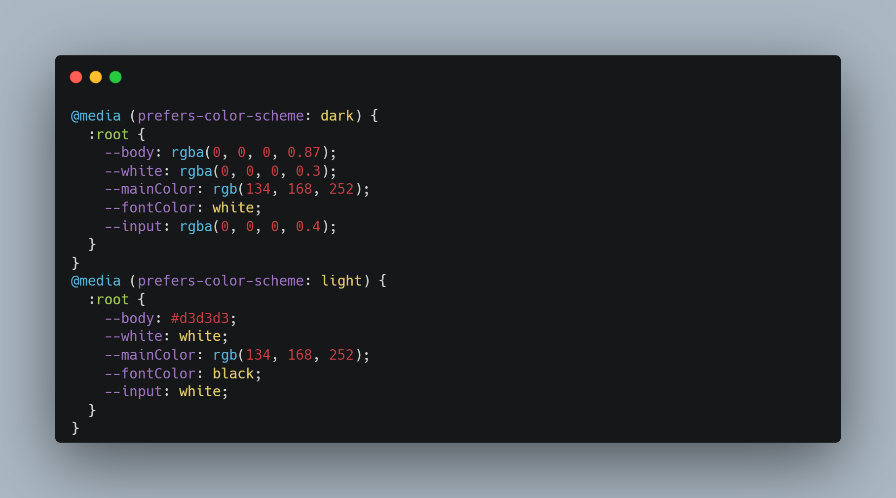

# note-app
this is my  " Note app " by using javascript local storage
try it and let me know your feedback .. ❤   
veiw note app : [demo ](https://note-app-wheat-mu.vercel.app/)   
the main fetures in the app : 
1. local storage
2. dark and light mode css

## When you use the app, you can add a note by clicking on 'add new note.' Then, the popup menu will be shown with fields and validation.
## After adding the note, it will be rendered with the date and delete button.
###dark mode code
in the following code the mode appares based on the user system confige

